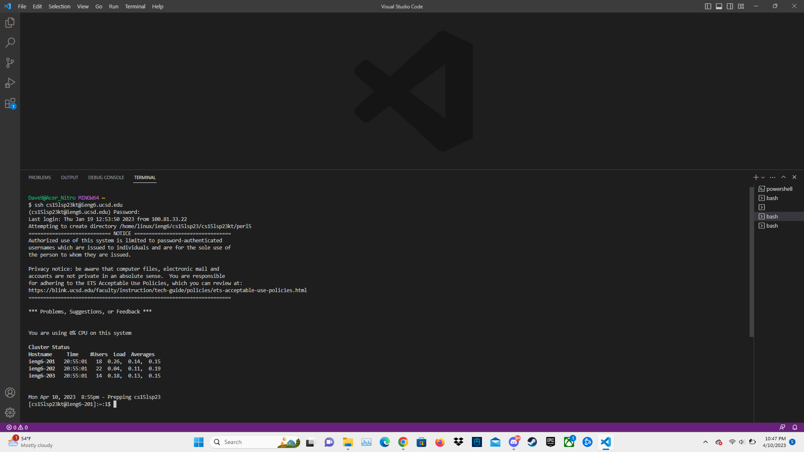
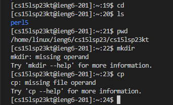
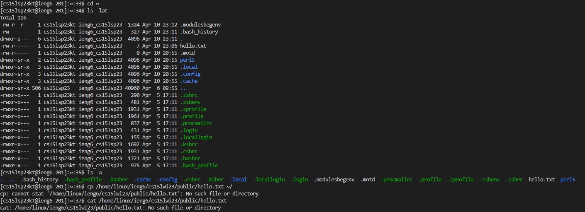

# How to Log into a Course-Specific Account on ieng6

---

## 1. Installing VS Code
   - Download the [Visual Studio Code](https://code.visualstudio.com/) program with the option that matches your OS (Operating Software)
   - Follow the instructions you receive when you install VS Code
   - When installed, your screen should look something like this <br/>
 <br/>
<br/><br/>

## 2. Remotely Connecting
   - For Windows users only, install [Git for Windows](https://gitforwindows.org/) and then to use [Bash](https://stackoverflow.com/questions/42606837/how-do-i-use-bash-on-windows-from-the-visual-studio-code-integrated-terminal/50527994#50527994), follow this thread
   - Open a terminal in VS Code with commands Ctrl + Shift + ' (Windows users make sure to use Bash) and type the command:
```sh
$ ssh cs15lsp23zz@ieng6.ucsd.edu
```
**Notes**: The "zz" will be replaced by your user specific letters; The "$" is an indication of what to type onto the terminal

First time users should see this: 
```sh
⤇ ssh cs15lwi23zz@ieng6.ucsd.edu
The authenticity of host 'ieng6.ucsd.edu (128.54.70.227)' can't be established.
RSA key fingerprint is SHA256:ksruYwhnYH+sySHnHAtLUHngrPEyZTDl/1x99wUQcec.
Are you sure you want to continue connecting (yes/no/[fingerprint])? 
```
   - Type "yes" onto the command prompt, then type your course specific password when prompted and you are connected if you see: <br/>

 <br/>
<br/><br/>
  
## 3. Trying Some Commands
   - Some commands you could try out are:
```sh
cd (Changes directory)
ls (List contents of directory)
pwd (Display current working directory)
mkdir (Make new directory)
cp (Copy directory)
```
This output is what you should have: <br/>
<br/>
 <br/>
   - More specific commands available to try out are:
```sh
cd ~ (Changes directory to user home directory)
ls -lat (List contents of directory in long format)
ls -a (List all files and directories in directory)
cp /home/linux/ieng6/cs15lwi23/public/hello.txt ~/ (Copies the hello.txt to current directory)
cat /home/linux/ieng6/cs15lwi23/public/hello.txt (Concatenates files and displays hello.txt contents)
```
The commands output this: <br/>
<br/>
 <br/>
---

