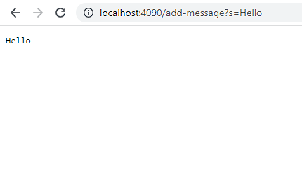

# Lab Report 2 - Servers and Bugs

---
## Part 1
Image of my code for the String server:
   

Image of adding "Hello" message:  
   
- The method in my code called is `handleRequest(URI url)` which takes in a URL as an argument, in this case it took http://localhost:4090/add-message?s=Hello and returns the string "Hello"
- The relevant arguments to the method are the `url.getPath().contains("/add-message")` if statement which checks if we are using the command `/add-message` on the URL and the `parameters[0].equals("s")` if statement which checks for the "s" in `/add-message?s`. The relevant fields in the class are `String single` which contains the value "Hello" and `String[] parameters` which contains the value "s" on index 0 and value "Hello" on index 1.
- The value of the `String[] parameters` became "s" on index 0  and "Hello" on index 1 by `url.getQuery().split("=")` splitting the "s" and "Hello" from the `add-message?s=Hello` by the "=" value. String single changed from "" to "Hello\n" if parameters[0] was "s".

Image of adding "How are you" message:  
   
- The method in my code called is `handleRequest(URI url)` which takes in a URL as an argument, in this case it took http://localhost:4090/add-message?s=How%20are%20you and returns the string "How Are You"
- The relevant arguments to the method are the `url.getPath().contains("/add-message")` if statement which checks if we are using the command `/add-message` on the URL and the `parameters[0].equals("s")` if statement which checks for the "s" in `/add-message?s`. The relevant fields in the class are `String single` which contains the value "How are you" and `String[] parameters` which contains the value "s" on index 0 and value "How are you" on index 1.
- The value of the `String[] parameters` became "s" on index 0  and "How are you" on index 1 by `url.getQuery().split("=")` splitting the "s" and "How are you" from the `add-message?s=How are you` by the "=" value. String single changed from "" to "How are you\n" if parameters[0] was "s".

## Part 2

