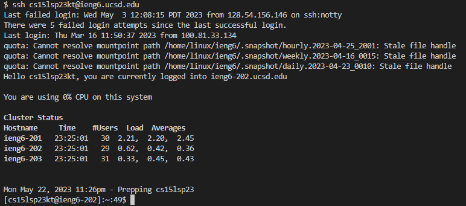
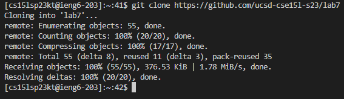
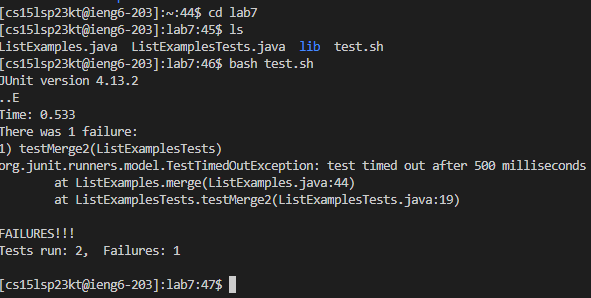
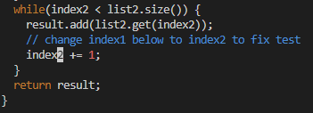
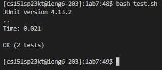

# Lab Report 4 - Vim

 

## 1. Log into ieng6
- Open the terminal
- Use the `ssh` command and type your ieng6 username
- Keys pressed `"ssh cs15lsp23kt@ieng6.ucsd.edu" <enter>`
 

 

## 2. Clone your fork of the repository from your Github account
- Use the `git clone` command and type the lab7 repository link
- Keys pressed `"git clone https://github.com/ucsd-cse15l-s23/lab7" <enter>`
 

 

## 3. Run the tests, demonstrating that they fail
- Use the `cd` command to change directory to lab7
- Run the tests by using the `bash` command on the test.sh file
- Keys pressed `"cd lab7" <enter> "bash test.sh" <enter>`
 

 

 

## 4. Edit the code file to fix the failing test
- Use the `vim` command with the ListExamples.java file
- Press `<down>` until you reach the index1 that needs change
- Press `<right> until you highlight the "1"
- Press `<x>` to delete the 1
- Press `<i>` to insert a 2
- Press `<esc> to exit out the insert mode
- Type `:wq` in order to save your changes
- Keys pressed `"vim ListExamples.java"`
 

 

 

## 5. Run the tests, demonstrating that they now succeed
- Run the tests by using the `bash` command on the test.sh file
 

 

 

## 6. Commit and push the resulting change to your Github account 
- Use the command `git add` with ListExamples.java
- Use the command `git commit -m` and name it
- Use the command `git push origin main`
