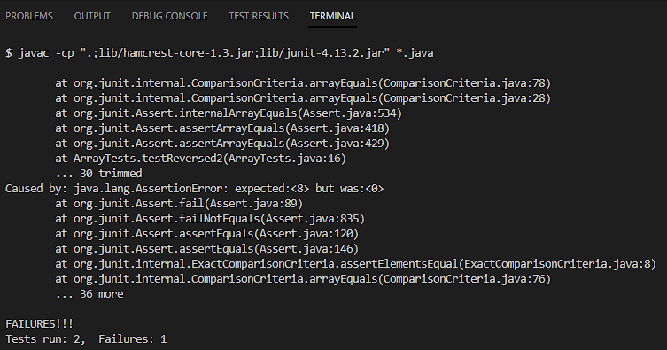

# Lab Report 5 - Putting it All Together

 

## 1. Debugging Scenario

### Environment
- Computer: Acer
- OS: Windows 11
- Web Browser: Chrome
- Terminal/Editor: Bash and VS Code

### Symptom
 
 
- Hello I was working on this code for the lab when I encountered this problem. When I was trying to test my code, 
I ran this command in order to test my code in junit but I received this error. I was wondering if there was something 
wrong with my code or if I typed the command right. 
### TA Response
- Hello there, when running tests for junit you have to use two commands. By the looks of it, you only typed one command 
on the terminal. A possibility is that you may not have typed the  command that compiles the code first. I suggest trying 
that first and then using the command you're currently using. Hope this helps you out!
### TA Help Result

- I did what you suggested and I got even more errors. I used the command to compile my code and the output had 14 errors. 
I thought I was using the correct command but it seems like I may have inputted the wrong command.
### Bug
- You may have copied and pasted the wrong commands from the lab. Go over to [Link](https://ucsd-cse15l-s23.github.io/week/week3/)
You are on a Windows computer therefore you need to make sure the commands you copy are under Windows users. Make sure you get
both commands to successfully be able to compile and run the junit tests. Your output after having used the corresponding 
commands to your system on the terminal should look like this. 

## 2. Reflection
- A cool thing I learned from the second half of the quarter in lab is using the command `vimtutor`. This was a really helpful 
command in which I could use to edit files with. Something else I learned is how to create our own autograders which was a bit 
easier than I thought it would be. Another cool thing I learned is how to use ssh keys. With ssh keys I was able to log into 
my ssh without having to enter my password which was pretty neat. 
